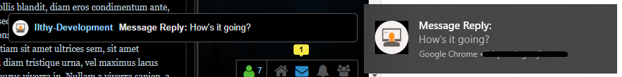

# Enjin Notifications
### Let your Enjin browser notifications appear on your desktop

This [Google Chrome](https://www.google.com/chrome/) extension allows you to have Chrome extensions pop up on your desktop. You can click on said pop up to go to the page of the notification.

Here are two example screenshots:

The black bar you can see on both images is the URL of the source of the notification - The website on which the script is enabled.

The notification will appear for any type of notification within Enjin:

- Likes
- Posts
- Application form - both sending and response
- Private Messages

## Disclaimer
*This extension is still in development. There will be bugs and/or missing features.*

Some known issues:

- Multiple open Enjin tabs logged in on the same account will mean that you will get multiple pop-ups on the same notification. This has been fixed in version 0.4, but can still appear if one tab is dragged in front of the other and then refreshed. 
- ~~Notifications will not appear if you are playing something on fullscreen.~~ Notifications will now appear in full screen too, [due to Chrome stepping over to OS native notifications in Windows 10](https://chromium-review.googlesource.com/c/chromium/src/+/955244 "Chromium Commit").
- The popups do not appear if you are on a HTTP site. The site needs to be HTTPS for the extension to work.

Potential Future Features:

- Settings per notification type

## Credit
I do want to credit [Enjin user ROJO](https://www.enjin.com/profile/rojo8399) for making [this post](https://www.enjin.com/forums/m/10826/viewthread/27087168-free-code-chrome-notifications/post/117997305#p117997305) back in May 2016. He gave me the base for this code, and I only altered it a little bit to transform it into a Chrome extension. 